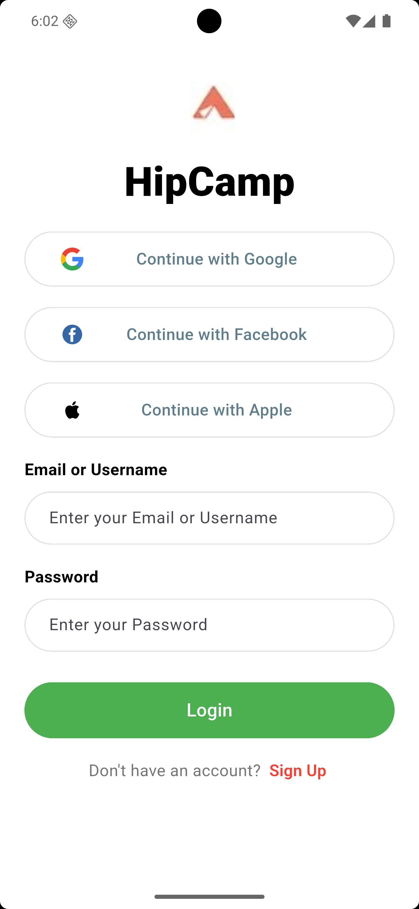
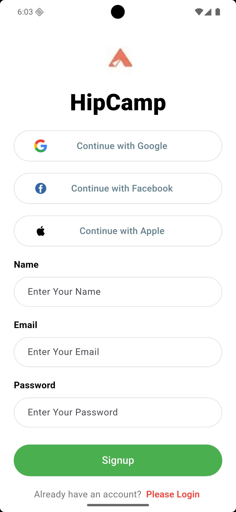
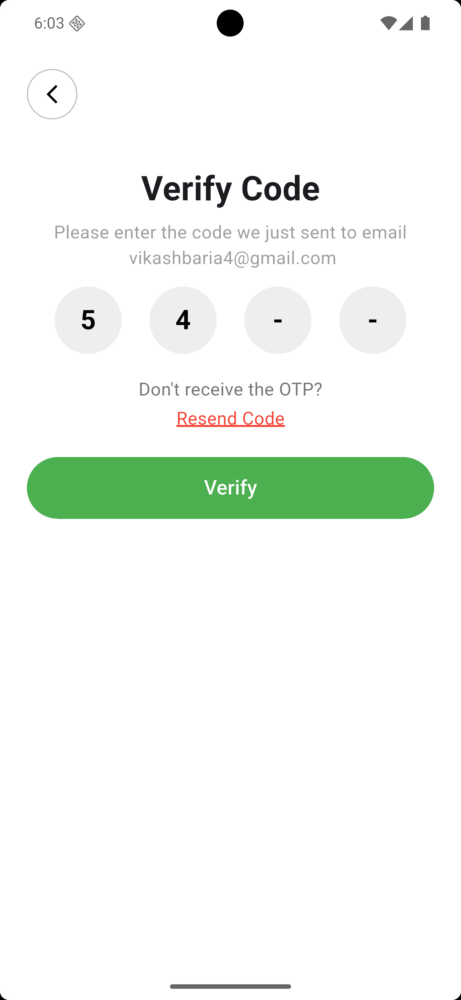

# 🚀 Flutter UI Convert Dribbble Design - Login / Signup / Code Verification

This project is a Flutter implementation of a **Dribbble-inspired UI design**, completed as part of **Saylani Quiz Assignment #2**.

The goal of this task was to convert a modern UI design into a fully functional Flutter layout using clean architecture and reusable components.

---

## 📌 Project Overview

This project includes three main screens:

- 🔐 Login Screen  
- 📝 Signup Screen  
- 🔑 Code Verification Screen  

Each screen is built with a focus on **clean UI, reusability, and scalability**.

---

## ✨ Features

- Reusable Global Widgets
- Custom TextFields with Validation
- Clean and Scalable Code Structure
- Responsive UI Design
- Email & Password Validation
- Verification Code UI
- Consistent Design System

---

## 🧱 Tech Stack

- Flutter 💙
- Dart

---

## 🧠 What I Learned

Through this assignment, I improved my understanding of:

- Flutter Widget Tree Structure
- State Management Basics
- Reusable Component Architecture
- Form Validation Techniques
- UI Conversion from Dribbble to Flutter

---

## 📸 Screenshots

### 🔐 Login Screen

### 📝 Signup Screen

### 🔑 Code Verification Screen

---

## 📁 Folder Structure (Optional)
lib/
┣ widgets/
┣ screens/
┣ main.dart

---

## 🎯 Task Information

This project was completed as part of:

👉 **Saylani Quiz Assignment #2**

---

## 👨‍💻 Developer

**Vikash Baria**

---

## ⭐ Note

This project focuses on **clean reusable architecture instead of repeated UI code**, making it scalable for future development.